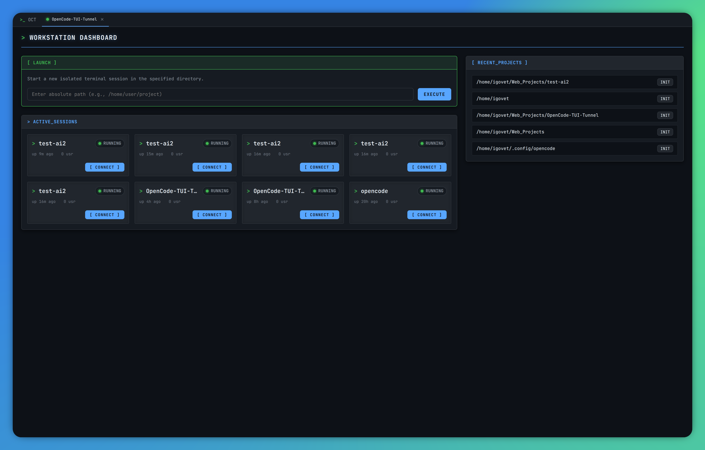
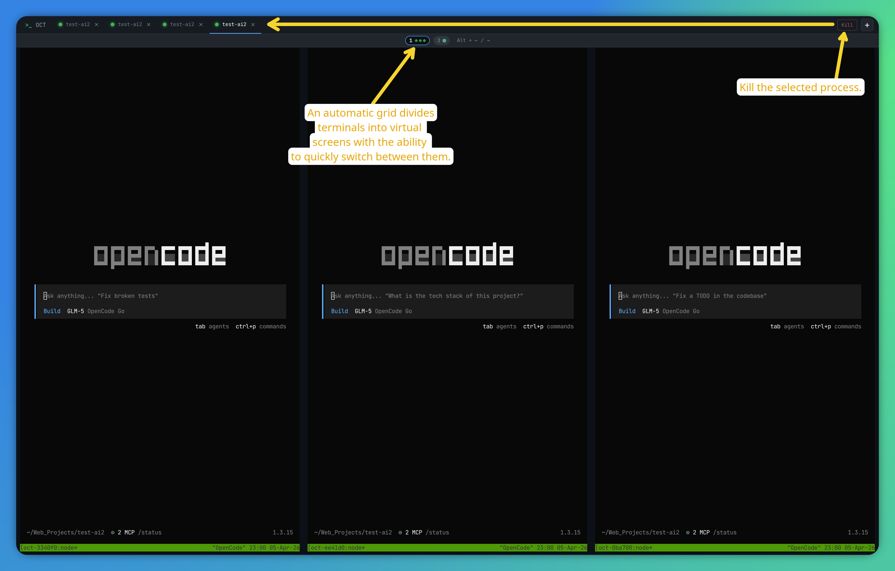
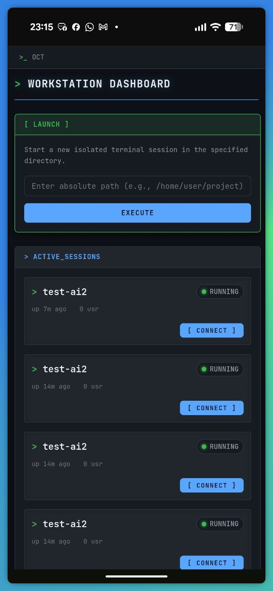
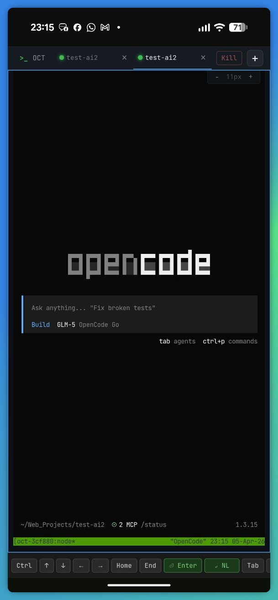

# OpenCode TUI Tunnel

<p align="center"><strong>Run your <code>opencode</code> terminal sessions anywhere — in a clean browser UI, on desktop or mobile.</strong></p>

<p align="center">
  <a href="https://www.npmjs.com/package/@igovet/opencode-tui-tunnel"></a>
  <a href="./LICENSE"></a>
  <a href="https://nodejs.org/en/download"></a>
</p>

## ✨ What is OpenCode TUI Tunnel?

OpenCode TUI Tunnel is a web tunnel for `opencode` terminal sessions. It gives you a browser-accessible workspace where you can launch, view, and manage multiple `opencode` sessions without being tied to a single terminal window.

It exists to make terminal-first workflows easier to access anywhere: local laptop, remote machine, desktop browser, or phone — while keeping sessions persistent through `tmux`.

## 🚀 Key Features

- 🖥️ **Browser-first terminal access** for `opencode` sessions (desktop + mobile)
- 🧠 **tmux-backed persistence** so sessions survive refreshes and restarts
- ➕ **Launch and manage multiple sessions** from a single web UI
- 📱 **Mobile-friendly controls** with an extended terminal key bar (Esc, Tab, Ctrl, arrows)
- ⚡ **PWA support** for installable app-like experience
- 🔔 **Browser notifications** when `opencode` asks questions or requests permissions
- 🔧 **Operational CLI tools** (`start`, `status`, `sessions`, `config`, `doctor`)
- 🚀 **Autostart support** on Linux (`systemd --user`) and macOS (`LaunchAgent`)
- 🔒 **Cloudflare Tunnel + Zero Trust friendly** for secure remote access

## 📸 Screenshots

<details>
  <summary>View screenshots</summary>
  <br>
  <br>
  
  
</details>

## 🎯 Use Cases

- 👨‍💻 **Developers** who want persistent `opencode` sessions across devices
- 🧪 **AI-assisted coding workflows** where multiple terminal sessions run in parallel
- 🏠 **Homelab / remote workstation users** who need secure browser access without opening inbound ports
- 📱 **On-the-go debugging** from a phone when you're away from your primary machine

## ⚡ Quick Start

```bash
npm install -g @igovet/opencode-tui-tunnel
opencode-tui-tunnel doctor
opencode-tui-tunnel start
```

Then open the printed URL (default: `http://127.0.0.1:4096`).

## 📖 Documentation

Continue below for full docs:

- [Requirements](#requirements)
- [Installation](#installation)
- [Usage](#usage)
- [CLI Reference](#cli-reference)
- [Cloudflare Tunnel Setup (Zero Trust Authentication)](#cloudflare-tunnel-setup-zero-trust-authentication)

---

## Requirements

- Node.js >= 20
- tmux
- opencode

## Installation

```bash
npm install -g @igovet/opencode-tui-tunnel
```

Or run directly:

```bash
npx @igovet/opencode-tui-tunnel
```

## Installation on macOS and Linux

### 1) Prerequisites

- **Node.js >= 20.0.0**
  - macOS: https://nodejs.org/en/download
  - Linux: https://nodejs.org/en/download
- **tmux**
  - macOS (Homebrew):
    ```bash
    brew install tmux
    ```
  - Debian/Ubuntu:
    ```bash
    sudo apt update && sudo apt install -y tmux
    ```
  - Fedora/RHEL (dnf):
    ```bash
    sudo dnf install -y tmux
    ```
- **For Linux: native module build tools**
  - Debian/Ubuntu:
    ```bash
    sudo apt update && sudo apt install -y build-essential python3
    ```
  - Fedora/RHEL:
    ```bash
    sudo dnf groupinstall -y "Development Tools" && sudo dnf install -y python3
    ```

### 2) Global installation

```bash
npm install -g @igovet/opencode-tui-tunnel
```

The package installs one CLI command:

- `opencode-tui-tunnel`

### 3) Alternative installation methods

- Via **npx** (without global installation):
  ```bash
  npx @igovet/opencode-tui-tunnel
  ```
- Via **yarn global**:
  ```bash
  yarn global add @igovet/opencode-tui-tunnel
  ```

### 4) Verification after installation

```bash
opencode-tui-tunnel --version
opencode-tui-tunnel doctor
```

### 5) Troubleshooting (macOS/Linux)

- **Permission errors (`EACCES`) during global npm install**
  - It is recommended to use Node via `nvm` or configure a user npm prefix.
  - Temporary workaround (less preferred): run with `sudo`.
- **Native module build errors**
  - Make sure `python3` and compiler tools are installed (`build-essential` or `Development Tools`).
  - Check your Node.js version (must be >= 20.0.0).
- **`tmux: command not found`**
  - Install `tmux` via your package manager and verify the binary is available in `PATH`.
  - Check your environment with: `opencode-tui-tunnel doctor`.

## Usage

### Start the server (daemon mode)

```bash
opencode-tui-tunnel start
```

`start` now launches the service in the background, prints the service URL and PID,
and exits the parent process after startup.

Example output:

```text
URL: http://127.0.0.1:4096
PID: 12345
```

If the service is already running, the command reports the existing URL/PID instead
of starting a duplicate process.

## PWA Support

`@igovet/opencode-tui-tunnel` web UI supports **Progressive Web App (PWA)** behavior on compatible browsers. This lets you install the app-like experience on desktop and mobile while still serving from your local tunnel URL.

### What PWA support means in this project

- A web app manifest (`/manifest.webmanifest`) defines app metadata and icons.
- A service worker (`/sw.js`) provides offline-capable caching behavior for app shell/navigation.
- On supported platforms, the app can be installed to desktop or home screen and launched in standalone/full-screen style UI.

### Benefits

- **Offline support (service worker):** cached app shell can still load when connectivity is intermittent.
- **Home screen / app launcher icon:** installable icon on desktop/mobile launch surfaces.
- **Full-screen / standalone experience:** app opens without standard browser tab chrome on supported platforms.
- **Push notifications:** not currently configured in this project.

### Desktop installation

- **Google Chrome:** `Menu (⋮) → Install app`
- **Microsoft Edge:** `Menu (…) → Apps → Install`
- **Mozilla Firefox:** install flow is not currently supported; use the app directly in the browser tab.

### Mobile installation

- **iOS Safari:** `Share → Add to Home Screen`
- **Android Chrome:** `Menu (⋮) → Add to Home Screen`

### Platform quick guide

1. Start the service:

   ```bash
   opencode-tui-tunnel start
   ```

2. Open the printed URL in your platform browser.
3. Follow the install path above for your browser/device.
4. Launch from the installed icon (desktop app list or mobile home screen).

## CLI Reference

### Command summary

| Command                                                                        | Description                                    |
| ------------------------------------------------------------------------------ | ---------------------------------------------- |
| `opencode-tui-tunnel --version`                                                | Show CLI version                               |
| `opencode-tui-tunnel --help`                                                   | Show root help                                 |
| `opencode-tui-tunnel start [--host <host>] [--port <port>] [--no-open]`        | Start the tunnel service in daemon mode        |
| `opencode-tui-tunnel autostart on [--host <host>] [--port <port>] [--no-open]` | Enable autostart and start service immediately |
| `opencode-tui-tunnel autostart off`                                            | Disable autostart and remove managed service   |
| `opencode-tui-tunnel status`                                                   | Show tunnel service status                     |
| `opencode-tui-tunnel sessions list [--json]`                                   | List running sessions                          |
| `opencode-tui-tunnel sessions kill <id>`                                       | Terminate a running session                    |
| `opencode-tui-tunnel config get [key]`                                         | Print full config or a specific key            |
| `opencode-tui-tunnel config set <key> <value>`                                 | Update a config key                            |
| `opencode-tui-tunnel config path`                                              | Print config file path                         |
| `opencode-tui-tunnel doctor`                                                   | Run environment diagnostics                    |

### Root command

#### Syntax

```bash
opencode-tui-tunnel --version
opencode-tui-tunnel --help
```

#### Options

| Option      | Type    | Default | Description                 |
| ----------- | ------- | ------- | --------------------------- |
| `--version` | boolean | `false` | Print CLI version and exit  |
| `--help`    | boolean | `false` | Print command help and exit |

#### Examples

```bash
opencode-tui-tunnel --version
opencode-tui-tunnel --help
```

### `start`

#### Syntax

```bash
opencode-tui-tunnel start [--host <host>] [--port <port>] [--no-open]
```

Start the tunnel service in daemon mode.

#### Flags

| Flag            | Type               | Default                            | Description                       |
| --------------- | ------------------ | ---------------------------------- | --------------------------------- |
| `--host <host>` | string             | `config.server.host` (`127.0.0.1`) | Host interface to bind            |
| `--port <port>` | number (`1-65535`) | `config.server.port` (`4096`)      | TCP port to bind                  |
| `--no-open`     | boolean            | `false`                            | Disable automatic browser opening |

#### Notes

- If the service is already running, the command reports the existing URL/PID instead of starting a second process.

#### Examples

```bash
opencode-tui-tunnel start
opencode-tui-tunnel start --port 4300
opencode-tui-tunnel start --host 0.0.0.0 --port 4300 --no-open
```

### `autostart`

#### `autostart on`

##### Syntax

```bash
opencode-tui-tunnel autostart on [--host <host>] [--port <port>] [--no-open]
```

Enable autostart and start the managed service immediately.

##### Flags

| Flag            | Type               | Default                            | Description                                                |
| --------------- | ------------------ | ---------------------------------- | ---------------------------------------------------------- |
| `--host <host>` | string             | `config.server.host` (`127.0.0.1`) | Host interface to pass to managed start command            |
| `--port <port>` | number (`1-65535`) | `config.server.port` (`4096`)      | Port to pass to managed start command                      |
| `--no-open`     | boolean            | `false`                            | Disable automatic browser opening in managed start command |

##### Notes

- Uses the same runtime flags and validation rules as `start`.
- Running `autostart on` again replaces the existing managed service definition.
- Platform support:
  - Linux: user `systemd` service
  - macOS: user `LaunchAgent`

##### Examples

```bash
opencode-tui-tunnel autostart on
opencode-tui-tunnel autostart on --host 0.0.0.0 --port 4300 --no-open
```

#### `autostart off`

##### Syntax

```bash
opencode-tui-tunnel autostart off
```

Disable autostart and remove the managed service definition.

##### Examples

```bash
opencode-tui-tunnel autostart off
```

### `status`

#### Syntax

```bash
opencode-tui-tunnel status
```

Show tunnel service status.

#### Examples

```bash
opencode-tui-tunnel status
```

### `sessions`

#### `sessions list`

##### Syntax

```bash
opencode-tui-tunnel sessions list [--json]
```

List running sessions.

##### Flags

| Flag     | Type    | Default | Description                               |
| -------- | ------- | ------- | ----------------------------------------- |
| `--json` | boolean | `false` | Print JSON output instead of table output |

##### Examples

```bash
opencode-tui-tunnel sessions list
opencode-tui-tunnel sessions list --json
```

#### `sessions kill`

##### Syntax

```bash
opencode-tui-tunnel sessions kill <id>
```

Terminate a running session.

##### Arguments

| Argument | Type   | Required | Description             |
| -------- | ------ | -------- | ----------------------- |
| `<id>`   | string | yes      | Session ID to terminate |

##### Examples

```bash
opencode-tui-tunnel sessions kill 12345678
```

### `config`

#### `config get`

##### Syntax

```bash
opencode-tui-tunnel config get [key]
```

Get full config or a specific key (dot notation).

##### Arguments

| Argument | Type   | Required | Description                                         |
| -------- | ------ | -------- | --------------------------------------------------- |
| `[key]`  | string | no       | Dot-notation config key (for example `server.port`) |

##### Examples

```bash
opencode-tui-tunnel config get
opencode-tui-tunnel config get server.port
opencode-tui-tunnel config get updates
```

#### `config set`

##### Syntax

```bash
opencode-tui-tunnel config set <key> <value>
```

Set a config key. Values support string, number, and boolean input.

##### Arguments

| Argument  | Type                        | Required | Description                                                                          |
| --------- | --------------------------- | -------- | ------------------------------------------------------------------------------------ |
| `<key>`   | string                      | yes      | Dot-notation config key                                                              |
| `<value>` | string \| number \| boolean | yes      | Value to store (`true`/`false` => boolean, numeric text => number, otherwise string) |

##### Examples

```bash
opencode-tui-tunnel config set server.port 4300
opencode-tui-tunnel config set server.host 0.0.0.0
opencode-tui-tunnel config set server.openBrowserOnStart false
```

#### `config path`

##### Syntax

```bash
opencode-tui-tunnel config path
```

Print config file path.

##### Examples

```bash
opencode-tui-tunnel config path
```

### `doctor`

#### Syntax

```bash
opencode-tui-tunnel doctor
```

Run environment diagnostics.

#### Checks

- Node.js version (required: `>=20`)
- `tmux` availability
- `opencode` availability in `PATH`
- Config directory availability/writability
- Packaged web assets (`dist/web/index.html`)

#### Examples

```bash
opencode-tui-tunnel doctor
```

## How it works

Sessions are managed by tmux — sessions survive browser refreshes and server restarts.
The web UI shows all active `opencode` sessions. Click to connect, or launch new sessions
in any project directory.

On service start, the app also checks for package updates in the background. For
global npm installs, it can apply updates automatically in a detached worker.
Updated code is used on the next restart of the service/process.

## Mobile support

Full mobile terminal support with custom key bar (Esc, Tab, Ctrl, arrows, etc.).

## Configuration

Config is stored at `~/.config/opencode-tui-tunnel/config.json`.

Key settings:

- `server.port` — default: 4096
- `paths.allowedRoots` — directories where new sessions can be launched
- `sessions.maxConcurrent` — max concurrent sessions (default: 8)

## Cloudflare Tunnel Setup (Zero Trust Authentication)

Use this when you want secure remote access to `opencode-tui-tunnel` without opening inbound firewall ports or configuring router port forwarding.

### 1) Overview

Cloudflare Tunnel (`cloudflared`) creates an outbound-only connection from your machine to Cloudflare's edge.
Requests to your public hostname are then proxied to your local `opencode-tui-tunnel` service.

Why this is useful for `@igovet/opencode-tui-tunnel`:

- Secure remote browser access to your local TUI sessions
- No public inbound port exposure
- Works well with Cloudflare Zero Trust Access policies

### 2) Prerequisites

- A Cloudflare account
- A domain managed in Cloudflare DNS
- Cloudflare Zero Trust enabled for your account/team
- `opencode-tui-tunnel` running locally (default `http://127.0.0.1:4096`)

### 3) Install `cloudflared` and authenticate

Install `cloudflared` (pick your platform package from Cloudflare docs):

- https://developers.cloudflare.com/cloudflare-one/connections/connect-networks/downloads/

Authenticate the CLI with your Cloudflare account:

```bash
cloudflared tunnel login
```

This opens a browser to authorize `cloudflared` for your Cloudflare zone.

### 4) Create and route a tunnel

Create a named tunnel:

```bash
cloudflared tunnel create opencode-tui-tunnel
```

Route a public hostname to the tunnel (example hostname):

```bash
cloudflared tunnel route dns opencode-tui-tunnel tunnel.example.com
```

### 5) Configure Zero Trust authentication

1. Open **Cloudflare Dashboard → Zero Trust → Access → Applications**.
2. Click **Add an application** and choose **Self-hosted**.
3. Set the application domain to your tunnel hostname (for example `tunnel.example.com`).
4. Create an Access policy (for example, allow specific emails/groups).
5. In login methods, enable:
   - your SSO IdP (Google, GitHub, Okta, Azure AD, etc.), and/or
   - **One-time PIN**.

> Note: Cloudflare Access does not provide a standalone local username/password database.
> "Password authentication" is typically handled by your configured IdP login flow, or by One-time PIN.

### 6) Example `cloudflared` config

Create `~/.cloudflared/config.yml`:

```yaml
tunnel: <TUNNEL_UUID>
credentials-file: /home/<user>/.cloudflared/<TUNNEL_UUID>.json

ingress:
  - hostname: tunnel.example.com
    service: http://localhost:4096
  - service: http_status:404
```

Run the tunnel:

```bash
cloudflared tunnel run opencode-tui-tunnel
```

### 7) Test the setup

1. Start the local service:

   ```bash
   opencode-tui-tunnel start
   ```

2. Start `cloudflared` (if not already running).
3. Open `https://tunnel.example.com` in a browser.
4. Confirm you are prompted by Cloudflare Access before the app loads.
5. Sign in via your configured method (SSO or One-time PIN) and verify the TUI page loads.

### 8) Troubleshooting

- **502 / connection errors from Cloudflare**
  - Verify `opencode-tui-tunnel` is running on port `4096`.
  - Check `service: http://localhost:4096` in `config.yml`.
- **Hostname does not resolve or route correctly**
  - Re-run `cloudflared tunnel route dns ...` and verify DNS record exists in Cloudflare.
  - Allow time for DNS propagation.
- **Access login prompt not shown**
  - Verify the Zero Trust Access app domain exactly matches the tunnel hostname.
  - Confirm policy is active and not bypassed by broader rules.
- **Authentication denied / login loop**
  - Confirm your user/group/email matches the Access policy allow rules.
  - Confirm the configured IdP is healthy and enabled.
- **`cloudflared` credentials or tunnel not found**
  - Re-run `cloudflared tunnel login`.
  - Check that the tunnel name/UUID in `config.yml` is correct.
